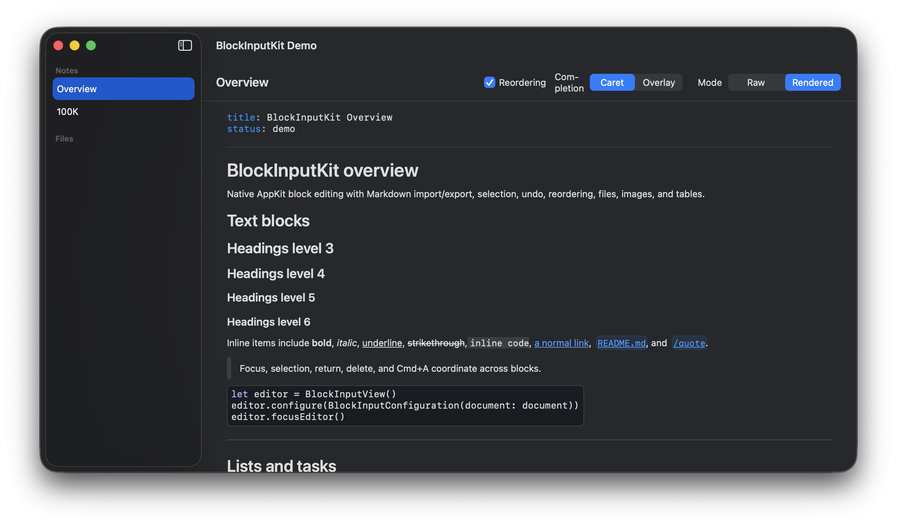

# BlockInputKit

_Not affiliated with Block, Inc. in any way._

BlockInputKit is a native Swift library for macOS apps that need structured block editing. Block editing makes every piece of content its own block, within a document containing a set of reorderable blocks. Each paragraph is a block, checklists and tables are blocks, etc.



## Installation

Add BlockInputKit as a pinned Swift Package dependency:

```swift
.package(url: "https://github.com/afollestad/BlockInputKit.git", exact: "x.y.z")
```

Then add the library product to your macOS target:

```swift
.product(name: "BlockInputKit", package: "BlockInputKit")
```

## Basic Configuration

```swift
import BlockInputKit

let document = BlockInputDocument(blocks: [
    BlockInputBlock(kind: .paragraph, text: "Hello"),
    BlockInputBlock(kind: .quote, text: "Each block owns its own text input.")
])

let configuration = BlockInputConfiguration(document: document)
```

## SwiftUI Hosting

```swift
import BlockInputKit
import SwiftUI

struct EditorScreen: View {
    let configuration: BlockInputConfiguration
    @State private var isEditorFocused = false

    var body: some View {
        BlockInputEditor(
            configuration: configuration,
            isFocused: $isEditorFocused
        )
    }
}
```

## AppKit Hosting

Use `BlockInputView` when the host needs direct editor access:

```swift
let editor = BlockInputView()
editor.configure(configuration)
```

## Configuration

Start with `BlockInputConfiguration(document:)` for in-memory editing. Use a store when the host owns persistence or wants granular mutation handling:

```swift
let store = BlockInputMemoryDocumentStore(document: document)

let configuration = BlockInputConfiguration(
    documentStore: store,
    onDocumentMutation: { change in
        print("Applied edit:", change)
    },
    onDocumentChange: { updatedDocument in
        print(updatedDocument.markdown)
    }
)
```

### Layout And Style

Use layout and style options when the editor needs to match the host surface:

```swift
let configuration = BlockInputConfiguration(
    document: document,
    allowsBlockReordering: true,
    editorHorizontalInset: 20,
    editorVerticalInset: 8,
    blockVerticalInsetMultiplier: 0.75,
    style: BlockInputStyle(
        editorSurface: BlockInputEditorSurfaceStyle(
            editorBackgroundColor: nil,
            scrollBackgroundColor: nil,
            collectionBackgroundColor: nil,
            chrome: BlockInputEditorChromeStyle(
                fillColor: NSColor.labelColor.withAlphaComponent(0.08),
                strokeColor: NSColor.labelColor.withAlphaComponent(0.18),
                borderWidth: 1,
                cornerRadius: 18,
                clipsContentToShape: true
            )
        ),
        imageBlock: BlockInputImageBlockStyle(cornerRadius: 8),
        fileChip: BlockInputInlineChipStyle(
            fillColor: NSColor.controlAccentColor.withAlphaComponent(0.14),
            strokeColor: NSColor.controlAccentColor.withAlphaComponent(0.24),
            foregroundColor: .labelColor,
            cornerRadius: 5
        ),
        slashCommandChip: BlockInputInlineChipStyle(
            fillColor: NSColor.controlAccentColor.withAlphaComponent(0.14),
            strokeColor: NSColor.controlAccentColor.withAlphaComponent(0.24),
            foregroundColor: .labelColor,
            cornerRadius: 5
        ),
        rawSlashCommandChip: BlockInputInlineChipStyle(
            fillColor: NSColor.controlAccentColor.withAlphaComponent(0.14),
            strokeColor: NSColor.controlAccentColor.withAlphaComponent(0.24),
            foregroundColor: .labelColor,
            cornerRadius: 5
        ),
        hashtagChip: BlockInputInlineChipStyle(
            fillColor: NSColor.systemTeal.withAlphaComponent(0.11),
            strokeColor: NSColor.systemTeal.withAlphaComponent(0.18),
            foregroundColor: .labelColor,
            cornerRadius: 6
        )
    )
)
```

`nil` editor surface colors are transparent so the host can draw its own background. Use
`BlockInputEditorChromeStyle` when the editor should draw its own rounded fill, stroke, and optional clipping. Chrome
can round all corners, top corners, bottom corners, or an explicit corner set. `dropIndicatorColor`, selection colors,
inline code, code block, image block, and inline chip styling are also configurable. Link-backed chips use their chip
foreground color instead of the system link text color.

`blockVerticalInsetMultiplier` adjusts vertical padding inside rendered block rows without changing horizontal layout or
the editor's outer `editorVerticalInset`. `1` preserves the built-in spacing, values below `1` make rows denser, and
values above `1` add more breathing room.

### Placeholder

Use `placeholder` for subtle empty-editor text. The placeholder is visual only; it is not inserted into the document,
included in Markdown export, or reported through document-change callbacks.

```swift
let configuration = BlockInputConfiguration(
    document: BlockInputDocument(),
    placeholder: "Ask anything"
)
```

### Read-Only Mode

Set `isEditable` to `false` to keep content selectable, copyable, scrollable, focusable, and accessible while blocking
editor-owned document mutations. Existing text is subtly dimmed, and `disabledCursor` can communicate the read-only
state over editor surfaces.

```swift
let configuration = BlockInputConfiguration(
    document: document,
    isEditable: false,
    disabledCursor: .operationNotAllowed
)
```

Read-only mode suppresses mutation commands, typing, paste/drop insertion, reordering, checklist toggles, table/image
editing controls, completion acceptance, and edit modals. Link opening and host-handled slash chip clicks can still run
when they do not mutate the document.

### Editor Height Sizing

Height sizing is opt-in. When enabled, the editor reports a rendered-content preferred height that starts at a default
visible line count, grows as content wraps or new blocks are added, and caps at a maximum visible line count when supplied.
Visible line counts are measured as one-line paragraph row equivalents, so `defaultVisibleLineCount: 3` leaves room for
three paragraph blocks created by Return. Extra content remains in the editor and scrolls vertically.

```swift
let configuration = BlockInputConfiguration(
    document: document,
    heightSizing: BlockInputEditorHeightSizing(
        defaultVisibleLineCount: 2,
        maximumVisibleLineCount: 8
    )
)
```

AppKit hosts can use intrinsic/fitting size, call `preferredHeight(forWidth:)`, or listen for clamped preferred-height
changes:

```swift
let editor = BlockInputView()
editor.configure(BlockInputConfiguration(
    document: document,
    heightSizing: BlockInputEditorHeightSizing(
        defaultVisibleLineCount: 2,
        maximumVisibleLineCount: 8,
        onPreferredHeightChange: { height in
            editorHeightConstraint.constant = height
        }
    )
))
```

Use transition callbacks when the host wants to animate height changes:

```swift
editor.configure(BlockInputConfiguration(
    document: document,
    heightSizing: BlockInputEditorHeightSizing(
        defaultVisibleLineCount: 2,
        maximumVisibleLineCount: 8,
        animation: .default,
        onPreferredHeightTransition: { transition in
            editorHeightConstraint.constant = transition.targetHeight
            guard let animation = transition.animation else {
                editor.superview?.layoutSubtreeIfNeeded()
                return
            }
            NSAnimationContext.runAnimationGroup { context in
                context.duration = animation.duration
                editor.superview?.layoutSubtreeIfNeeded()
            }
        }
    )
))
```

SwiftUI hosts can pass the same configuration to `BlockInputEditor`; fixed `.frame(height:)` values remain authoritative.
Sizing is based on rendered height, so wrapping, block chrome, tables, images, and code blocks can affect growth. Callback
measurement is reliable after the editor has a real width.

### Commands

Semantic commands let toolbar buttons, menu items, and host UI use the same paths as keyboard shortcuts and editor menus:

```swift
editor.performCommand(.bold)
editor.performCommand(.insertLink(BlockInputInsertLinkCommand(
    text: "Docs",
    urlString: "https://example.com",
    presentation: .automatic
)))

if editor.canPerformCommand(.insertTable) {
    editor.performCommand(.insertTable)
}
```

SwiftUI hosts can keep a dispatcher in state and pass it through configuration:

```swift
@State private var commandDispatcher = BlockInputEditorCommandDispatcher()

BlockInputEditor(configuration: BlockInputConfiguration(
    commandDispatcher: commandDispatcher
))

Button("Bold") {
    commandDispatcher.perform(.bold)
}
```

`BlockInputEditorCommand` covers undo, redo, select all, clipboard actions, inline formatting, links, images, and table insertion/row/column/table actions.

By default, `Cmd+A` selects the focused content before promoting to the whole document. Empty
focused text blocks promote directly to the whole document unless they are the only placeholder-eligible block, where
select all leaves the caret collapsed with no visible selection. Hosts that want `Cmd+A` to select the whole document
immediately when content exists can opt in:

```swift
BlockInputConfiguration(selectAllBehavior: .document)
```

### Host Keyboard Shortcuts

Register keyboard shortcuts when the host needs to intercept keys before the editor's built-in behavior. Only dictionary
keys are intercepted; unregistered keys keep normal AppKit/editor behavior.

```swift
let configuration = BlockInputConfiguration(
    keyboardShortcuts: [
        .returnKey: { context in
            sendMessage()
            return .handled
        },
        .shiftReturn: { _ in
            .performDefault(.returnKey)
        },
        .optionReturn: { context in
            runCustomAction(selection: context.selection)
            return .handled
        }
    ]
)
```

Handlers run synchronously on the main actor before default editor mutation/navigation, including text blocks, table
cells, image carets, and whole-block selections. Completion popups, modal fields, and active IME marked text keep
priority over host shortcuts. Return `.ignored` to continue the original event, or `.performDefault(.returnKey)` to
explicitly run plain Return behavior without recursively invoking the host handler. Shortcut matching normalizes keypad
Enter to Return, ignores inert flags such as numeric pad/caps lock, and lowercases single-character keys.
Selector-only fallback uses `NSApp.currentEvent` when available, then maps known Return, Tab, Arrow, word, and document
movement selectors to the same public shortcut values. Start async host work from the handler after returning `.handled`
rather than blocking key dispatch.

### Callbacks

Use callbacks for host state, persistence, and focus wiring:

- `onDocumentMutation`: receives granular edits as they are applied.
- `onDocumentChange`: receives coalesced full-document snapshots.
- `documentChangeSnapshotDelay`: tunes snapshot coalescing for large documents.
- `onSelectionChange`: observes cursor, text, and block selection changes.
- `onFocusChange`: observes editor focus changes.
- `undoController`: shares text and structural undo coordination with the host.

## Completion

Set `completionProvider` to support `@` mentions and `/` slash commands. When it is `nil`, typing `@` or `/` does not open a popup.

The provider receives a `BlockInputCompletionContext` with:

- `trigger`: `.mention` or `.slashCommand`.
- `replacementRange`: the UTF-16 source range replaced when a suggestion is accepted.
- `rawQuery`: the text after `@` or `/`.
- `fileQuery`: parsed file intent for `.`, `..`, and `...` prefixes.

Set `completionReturnBehavior: .passthroughExactMatch` when Return should pass through to host shortcuts or normal editor
Return handling if the active replacement text already exactly matches the highlighted suggestion. Suggestions match against
`exactMatchText` when set, otherwise `insertionText`. Slash-command helpers set this to the visible `/command` token while
still inserting the configured source plus a trailing space. Tab continues accepting the highlighted suggestion.

### Popup Placement

`completionPopupConfiguration` controls popup placement:

```swift
let configuration = BlockInputConfiguration(
    document: document,
    completionProvider: provider,
    completionPopupConfiguration: BlockInputCompletionPopupConfiguration(placement: .caret)
)
```

Use `.overlay` when the host needs to choose the popup parent view and frame. The overlay provider returns both together, and the frame must be in that container's coordinate space:

```swift
BlockInputCompletionPopupConfiguration(placement: .overlay) { context in
    let container = context.editorView
    var frame = context.editorFrame(in: container)
    frame.origin.y += 12
    frame.size.height = context.popupSize.height

    return BlockInputCompletionPopupOverlay(container: container, frame: frame)
}
```

Pass `style:` to customize the built-in popup chrome without replacing the editor-owned interaction model:

```swift
BlockInputCompletionPopupConfiguration(
    placement: .overlay,
    style: BlockInputCompletionPopupStyle(
        backgroundColor: popupBackground,
        borderColor: popupBorder,
        highlightedRowBackgroundColor: selectedRowBackground,
        highlightedRowCornerRadius: selectedRowCornerRadius
    ),
    overlayProvider: overlayProvider
)
```

When `highlightedRowCornerRadius` is omitted, selected rows use the popup `cornerRadius`.

### Link And Image Modal Placement

By default, the built-in link and image modals are direct children of the editor and use editor bounds for placement. Use
`modalOverlayProvider` when the host needs those modals to live in a higher overlay surface:

```swift
let configuration = BlockInputConfiguration(
    document: document,
    modalOverlayProvider: { context in
        let container = overlayView
        return BlockInputModalOverlay(
            container: container,
            frame: context.modalFrame(in: container)
        )
    }
)
```

The provider receives the modal kind, default editor-owned frame, measured modal size, and source anchor. Return the
modal parent view plus a frame in that parent's coordinate space.

### File Mentions

For file mentions in paragraphs or headings, return a file-link suggestion:

```swift
BlockInputCompletionSuggestion.fileLink(fileURL: readmeURL)
```

The helper inserts a Markdown file link followed by a space and renders the link as a chip:

```markdown
[README.md](file:///resolved/README.md)
```

The trailing space leaves the caret after the accepted file chip.

Plain click opens the link modal. Cmd-click opens through the editor URL opener hook.

### Slash Commands

Return slash-command suggestions when `context.trigger == .slashCommand`:

```swift
BlockInputCompletionSuggestion.slashCommand(
    title: "Insert table",
    uri: "myapp://commands/table",
    label: "table"
)
```

`slashCommandAvailability` controls where `/` opens completion. Use `.documentStart` for only the start of the first block, or `.anywhere` for token-boundary slash commands in supported text blocks. Configure `slashCommandChipClickHandler` when slash chips should run host behavior, open their URI, or show the built-in link modal.

The slash-command helper inserts command source followed by a space so the caret lands after the accepted command chip.
By default that source is a Markdown link.

Set `rawSlashCommandChips` and use `.rawToken` insertion when the underlying Markdown should stay as `/command` text while
still rendering the token as a chip:

```swift
let configuration = BlockInputConfiguration(
    document: document,
    rawSlashCommandChips: true,
    slashCommandAvailability: .documentStart
)

BlockInputCompletionSuggestion.slashCommand(
    title: "Review GitHub PR",
    uri: "myapp://commands/review-github-pr",
    label: "review-github-pr",
    insertionStyle: .rawToken
)
```

Raw slash chips are visual only. They keep editing, selection, copy, accessibility text, and Markdown export behavior as
normal text. Link-backed slash chips and `slashCommandChipClickHandler` routing are unchanged.

### Inline Argument Hints

Use `inlineHintProvider` for visual-only slash-command argument hints after the active caret. Hints are not inserted into
document text, Markdown export, undo, pasteboard contents, completion ranges, or accessibility value text.

```swift
let argumentHints = BlockInputSlashCommandArgumentHints([
    "review-github-pr": "[PR URL]"
])

let configuration = BlockInputConfiguration(
    document: document,
    slashCommandAvailability: .documentStart,
    inlineHintProvider: { argumentHints.inlineHint(for: $0) }
)
```

The provider only runs for a focused, editable, inline-Markdown-capable block with a valid collapsed selection.
`BlockInputSlashCommandArgumentHints` supports raw `/command` text and link-backed slash command chips.

## File Drops

Dragging local files onto supported text blocks inserts file chips at the drop caret. Image files insert image blocks below the target block.

Use `fileDropHandler` to copy files into project storage, rewrite destinations, or reject a drop before mutation:

```swift
let projectURL = URL(filePath: "/Users/me/Project", directoryHint: .isDirectory)

let configuration = BlockInputConfiguration(
    document: document,
    fileBaseURL: projectURL,
    imageBaseURL: projectURL,
    fileDropHandler: { context in
        let references = try context.files.map { file in
            let destination = projectURL
                .appending(path: "Assets", directoryHint: .isDirectory)
                .appending(path: file.url.lastPathComponent)
            try FileManager.default.copyItem(at: file.url, to: destination)

            return BlockInputFileDropReference(
                kind: file.defaultKind,
                source: "Assets/\(destination.lastPathComponent)",
                label: file.defaultLabel
            )
        }
        return .insert(references)
    }
)
```

Return `.useDefault` for built-in insertion, `.cancel` to leave the document unchanged, or `.insert(...)` with replacement references.

## Checklist Hashtags

Checklist blocks detect `#tag` patterns and render them as inline chip badges. Tags start with `#` followed by alphanumeric characters, hyphens, and underscores (e.g., `#groceries`, `#my-tag`, `#tag123`). The `#` must not be preceded by a word character.

```swift
let blocks: [BlockInputBlock] = [
    BlockInputBlock(
        id: "1",
        kind: .checklistItem(isChecked: false),
        text: "buy milk #groceries"
    ),
    BlockInputBlock(
        id: "2",
        kind: .checklistItem(isChecked: true),
        text: "reply to email #work"
    )
]
```

Hashtag badges are visual only. They keep editing, selection, copy, accessibility text, and Markdown export behavior as normal text. Tags render only in checklist blocks; `#tag` text in paragraphs, headings, quotes, or other block kinds stays plain text.

Configure the badge appearance through `BlockInputStyle.hashtagChip`:

```swift
let style = BlockInputStyle(
    hashtagChip: BlockInputInlineChipStyle(
        fillColor: NSColor.systemTeal.withAlphaComponent(0.11),
        strokeColor: NSColor.systemTeal.withAlphaComponent(0.18),
        foregroundColor: .labelColor,
        cornerRadius: 6
    )
)
```

## Images

Markdown image syntax and HTML image tags parse as standalone `.image` blocks:

```markdown


```

Images typed, pasted, parsed, or inserted in the middle of supported text split the source into text before, image block, and text after. Dropped local images insert below the target text block.

Remote images load through `BlockInputImageLoading`. The default loader memory-caches loaded images, can use `BlockInputImageDiskCaching` for remote disk cache entries, and respects source byte and pixel limits.

Image blocks with known dimensions can be resized from the right or bottom edge. Resizing persists `width` and `height` on `BlockInputImage` and exports as an HTML `` tag.

## Tables

### Parsing

GFM-style pipe tables parse and render as `.table` blocks. A table requires a header row and delimiter row; body rows are optional.

Typing or pasting a complete valid pipe table into an applicable text block converts that block into a table. Markdown typed or pasted inside an existing table cell stays cell text.

### Editing

Cells are editable text views. Inline formatting, link insertion/removal, URL paste, plain link click, and Cmd-click URL opening use the same paths as normal text blocks when the selected source range is inside one cell.

Mention/slash completion and local file-drop insertion are disabled inside table cells. Formatting is not applied to delimiters, pipes, padding, separator rows, or ranges crossing cells.

### Keyboard And Menus

- `Tab` and `Shift+Tab` move horizontally through cells.
- `Return` and `Shift+Return` move vertically when another cell exists, or insert a paragraph outside the table at boundaries.
- `Shift+Arrow` expands or collapses rectangular cell selection.
- Backspace/Delete in empty body cells selects, then removes, the row.
- `Cmd+A` selects cell contents, then the table block, then all blocks. With `selectAllBehavior: .document`, it selects
  all blocks immediately.

Right-click menus expose table actions when they apply: `Insert Table`, `Insert Row`, `Insert Column`, `Delete Row`, `Delete Column`, and `Delete Table`.

### Selection And Layout

Whole-table and mixed selections copy or cut normalized table Markdown. Partial cell selections copy or cut only selected cell text. SwiftUI focus restoration can return to a table cell when the active selection maps to cell content.

Columns measure content with padding, clamp from `120 pt` to `420 pt`, and wrap after the maximum width. Wide tables use horizontal-only scrolling while vertical wheel gestures continue scrolling the editor.

## Markdown

Use async Markdown APIs when reading or writing files:

```swift
let url = URL(filePath: "/tmp/note.md")
let document = try await BlockInputDocument.readingMarkdown(from: url)
try await document.writeMarkdown(to: url)

let parsed = await BlockInputDocument.parsingMarkdown("# Heading")
let markdown = await parsed.markdownSnapshot()
```

Custom storage can implement streaming protocols directly:

```swift
struct DatabaseLineReader: BlockInputMarkdownLineReader {
    mutating func readMarkdownLine() async throws -> String? {
        nil
    }
}

struct ChunkWriter: BlockInputMarkdownWriter {
    mutating func writeMarkdown(_ chunk: String) async throws {
        // Persist this chunk immediately.
    }
}

var reader = DatabaseLineReader()
let streamed = try await BlockInputDocument.readMarkdown(from: &reader)

var writer = ChunkWriter()
try await streamed.writeMarkdown(to: &writer)
```

Rendered text blocks visually style inline Markdown while preserving source text for editing and export. Unsupported block-level constructs are retained as `rawMarkdown` blocks.

## Demo

Run the local demo:

```sh
./scripts/run-demo.sh
```

The default `Overview` note is a compact feature tour with common block types, inline items, tables, and bundled image media.
The `100K` note remains the large-document performance sample.
The demo also includes file mention suggestions, slash commands with `.anywhere` availability, and a `Caret`/`Overlay` completion placement control.

## Validation

```sh
./scripts/build.sh
./scripts/test.sh
./scripts/lint.sh
```

Linting uses the repo SwiftLint configuration in `.swiftlint.yml`; keep project exceptions centralized there instead of adding inline suppression comments.

Agent workflows live under `.agents`: capability workflows in `.agents/skills`, and review or audit checks in `.agents/checks`.

## Snapshot Tests

Verify the representative snapshot suite:

```sh
./scripts/snapshots.sh verify
```

Verify or record a focused snapshot test:

```sh
./scripts/snapshots.sh verify BlockInputKitTests/BlockInputViewSnapshotTests
./scripts/snapshots.sh record BlockInputKitTests/BlockInputViewSnapshotTests
```

When no test identifier is provided, `./scripts/snapshots.sh` defaults to `BlockInputKitTests/BlockInputViewSnapshotTests`.

## License

BlockInputKit is licensed under the [GNU Lesser General Public License v3.0](LICENSE.txt).
